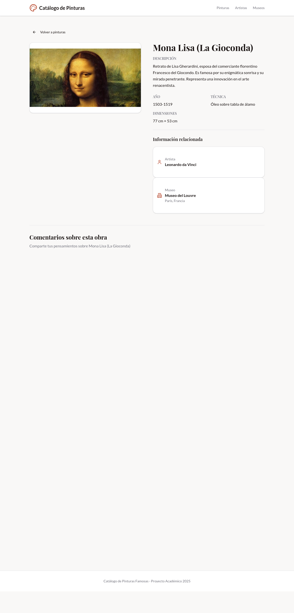

# Integración de Utterances - Sistema de Comentarios

## Introducción

Este documento describe la integración de **Utterances**, un sistema de comentarios basado en GitHub Issues, en el Catálogo de Pinturas Famosas. Utterances permite que los visitantes del sitio web comenten directamente en las páginas, con los comentarios almacenados como issues en un repositorio de GitHub.

---

## 1. ¿Qué es Utterances?

Utterances es un widget de comentarios ligero y de código abierto que utiliza GitHub Issues como backend para almacenar comentarios. Algunas características principales incluyen:

- **Basado en GitHub:** Los comentarios se almacenan como issues en un repositorio público de GitHub
- **Sin base de datos:** No requiere servidor propio ni base de datos
- **Autenticación con GitHub:** Los usuarios necesitan una cuenta de GitHub para comentar
- **Código abierto:** Completamente gratuito y personalizable
- **Responsive:** Se adapta a cualquier tamaño de pantalla
- **Temas:** Soporta múltiples temas de apariencia

---

## 2. Configuración de Utterances

### 2.1 Requisitos Previos

Para usar Utterances, se necesita:

1. **Repositorio público en GitHub** - Los comentarios se almacenan como issues
2. **Aplicación Utterances instalada** - Debe estar instalada en el repositorio

### 2.2 Pasos de Configuración

**Paso 1: Crear el repositorio**

Se creó un repositorio público en GitHub con el nombre `catalogo-pinturas-comentarios`:
- URL: https://github.com/CaldeIsa/catalogo-pinturas-comentarios

**Paso 2: Instalar la aplicación Utterances**

1. Visita https://github.com/apps/utterances
2. Haz clic en "Install"
3. Selecciona el repositorio `catalogo-pinturas-comentarios`
4. Autoriza el acceso

**Paso 3: Configurar en el sitio web**

Se creó un componente React que carga el script de Utterances en todas las páginas de contenido.

---

## 3. Implementación Técnica

### 3.1 Componente Comments.tsx

Se creó un componente reutilizable que encapsula la funcionalidad de Utterances:

```tsx
import { useEffect, useRef } from "react";

interface CommentsProps {
  title?: string;
  description?: string;
}

export default function Comments({ title = "Comentarios", description = "" }: CommentsProps) {
  const containerRef = useRef<HTMLDivElement>(null);

  useEffect(() => {
    if (!containerRef.current) return;

    const script = document.createElement("script");
    script.src = "https://utteranc.es/client.js";
    script.async = true;
    script.crossOrigin = "anonymous";
    
    script.setAttribute("repo", "CaldeIsa/catalogo-pinturas-comentarios");
    script.setAttribute("issue-term", "pathname");
    script.setAttribute("label", "comments");
    script.setAttribute("theme", "light");
    script.setAttribute("loading", "lazy");

    containerRef.current.appendChild(script);
  }, []);

  return (
    <div className="mt-12 pt-8 border-t border-border">
      <h2 className="text-2xl font-bold mb-2 text-foreground">{title}</h2>
      {description && (
        <p className="text-muted-foreground mb-6">{description}</p>
      )}
      <div 
        ref={containerRef}
        className="utterances-container"
      />
    </div>
  );
}
```

### 3.2 Configuración de Utterances

Las opciones configuradas en el componente son:

| Opción | Valor | Descripción |
|--------|-------|-------------|
| `repo` | CaldeIsa/catalogo-pinturas-comentarios | Repositorio donde se almacenan los comentarios |
| `issue-term` | pathname | Mapea comentarios por URL de la página |
| `label` | comments | Etiqueta de GitHub para los issues de comentarios |
| `theme` | light | Tema claro para coincidir con el diseño del sitio |
| `loading` | lazy | Carga el widget de forma perezosa para mejor rendimiento |

### 3.3 Integración en Páginas

El componente `Comments` se integró en todas las páginas de contenido:

1. **Página de Pinturas** (`Pinturas.tsx`)
2. **Detalle de Pintura** (`PinturaDetalle.tsx`)
3. **Página de Artistas** (`Artistas.tsx`)
4. **Detalle de Artista** (`ArtistaDetalle.tsx`)
5. **Página de Museos** (`Museos.tsx`)
6. **Detalle de Museo** (`MuseoDetalle.tsx`)

---

## 4. Cómo Funciona

### 4.1 Flujo de Comentarios

1. **Usuario visita una página** - El componente Comments carga el script de Utterances
2. **Script se ejecuta** - Utterances detecta la URL de la página (pathname)
3. **Búsqueda de issue** - Busca un issue en GitHub con el título correspondiente a la URL
4. **Mostrar comentarios** - Si existe, muestra los comentarios; si no, crea uno nuevo
5. **Usuario comenta** - El visitante puede hacer clic en "Sign in with GitHub" para comentar
6. **Comentario se guarda** - El comentario se publica como respuesta al issue en GitHub

### 4.2 Mapeo de URLs a Issues

Utterances utiliza la URL de la página para mapear comentarios. Por ejemplo:

- `/` → Issue: "/"
- `/pintura/mona-lisa` → Issue: "/pintura/mona-lisa"
- `/artista/leonardo-da-vinci` → Issue: "/artista/leonardo-da-vinci"
- `/museo/museo-del-louvre` → Issue: "/museo/museo-del-louvre"

Esto permite que cada página tenga su propio hilo de comentarios independiente.

---

## 5. Ventajas de Utterances

1. **Gratuito** - No hay costos de servidor ni base de datos
2. **Fácil de usar** - Los visitantes solo necesitan una cuenta de GitHub
3. **Transparencia** - Todos los comentarios son públicos en GitHub
4. **Control de spam** - GitHub maneja la moderación
5. **Integración con GitHub** - Los comentarios se vinculan con perfiles de GitHub
6. **Personalizable** - Se puede cambiar el tema y la apariencia
7. **Sin cookies de rastreo** - Respeta la privacidad del usuario

---

## 6. Limitaciones

1. **Requiere GitHub** - Los usuarios deben tener cuenta de GitHub para comentar
2. **Dependencia externa** - Requiere conexión a GitHub y utterances.es
3. **Moderación manual** - Los administradores deben moderar los comentarios en GitHub
4. **Sin notificaciones en el sitio** - Las notificaciones se envían por correo desde GitHub

---

## 7. Screenshots del Funcionamiento

Se capturaron screenshots de todas las páginas con el sistema de comentarios integrado:

### 7.1 Página de Pinturas

*Sección de comentarios en la página principal de pinturas*

### 7.2 Detalle de Pintura

*Sección de comentarios en la página de detalle de una pintura específica*

### 7.3 Página de Artistas

*Sección de comentarios en la página de artistas*

### 7.4 Detalle de Artista

*Sección de comentarios en la página de detalle de un artista*

### 7.5 Página de Museos

*Sección de comentarios en la página de museos*

### 7.6 Detalle de Museo

*Sección de comentarios en la página de detalle de un museo*

---

## 8. Cómo Usar los Comentarios

### Para Visitantes

1. **Navega a cualquier página** del catálogo
2. **Desplázate hasta la sección "Comentarios"** al final de la página
3. **Haz clic en "Sign in with GitHub"** para iniciar sesión
4. **Escribe tu comentario** en el campo de texto
5. **Haz clic en "Comment"** para publicar

### Para Moderadores

1. **Ve al repositorio** https://github.com/CaldeIsa/catalogo-pinturas-comentarios
2. **Abre la pestaña "Issues"** para ver todos los comentarios
3. **Revisa los comentarios** en cada issue
4. **Edita o elimina** comentarios si es necesario
5. **Cierra issues** si es necesario

---

## 9. Configuración Futura

Se pueden realizar las siguientes mejoras:

1. **Cambiar tema** - Modificar el atributo `theme` a "dark" para tema oscuro
2. **Agregar más etiquetas** - Usar diferentes etiquetas para categorizar comentarios
3. **Habilitar reacciones** - Permitir que los usuarios reaccionen a comentarios
4. **Restringir comentarios** - Limitar comentarios a usuarios específicos
5. **Integrar con notificaciones** - Crear un sistema de notificaciones personalizado

---

## 10. Conclusiones

La integración de Utterances proporciona un sistema de comentarios robusto, gratuito y fácil de mantener para el Catálogo de Pinturas Famosas. Los visitantes pueden compartir sus opiniones sobre las obras de arte, artistas y museos de manera sencilla, mientras que los administradores pueden moderar los comentarios directamente desde GitHub.

Este sistema demuestra cómo las aplicaciones web modernas pueden aprovechar servicios externos como GitHub para proporcionar funcionalidades avanzadas sin necesidad de infraestructura compleja.

---

**Fin del documento**
