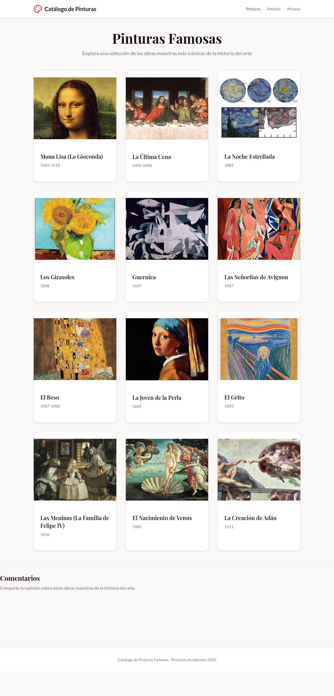

# Guía: Cómo Hacer Comentarios en el Catálogo de Pinturas

## ¿Qué es Utterances?

Utterances es un sistema de comentarios basado en GitHub Issues que permite a los visitantes del sitio web comentar directamente sobre las obras de arte, artistas y museos. Los comentarios se almacenan en un repositorio de GitHub público.

---

## Pasos para Hacer un Comentario

### Paso 1: Navega a Cualquier Página

Abre el sitio web del Catálogo de Pinturas en https://catalogo-pinturas-comentarioss.netlify.app/

Puedes comentar en cualquiera de estas páginas:
- **Página de Pinturas** - Comentarios generales sobre todas las obras
- **Detalle de Pintura** - Comentarios específicos sobre una pintura
- **Página de Artistas** - Comentarios sobre los artistas
- **Detalle de Artista** - Comentarios sobre un artista específico
- **Página de Museos** - Comentarios sobre los museos
- **Detalle de Museo** - Comentarios sobre un museo específico

### Paso 2: Desplázate Hasta la Sección "Comentarios"

Baja hasta el final de la página. Verás una sección titulada **"Comentarios"** con la descripción "Comparte tu opinión sobre..."



### Paso 3: Haz Clic en "Sign in with GitHub"

En la sección de comentarios, verás un botón o enlace que dice **"Sign in with GitHub"**. Haz clic en él.


### Paso 4: Autoriza la Aplicación

Se abrirá una ventana de GitHub pidiéndote que autorices la aplicación Utterances. Haz clic en **"Authorize utterances"**.

**Requisitos:**
- Debes tener una cuenta de GitHub
- Si no tienes una, crea una en https://github.com/signup

### Paso 5: Escribe Tu Comentario

Una vez autorizado, verás un campo de texto donde puedes escribir tu comentario. Escribe tu opinión sobre la obra de arte, artista o museo.

**Puedes usar:**
- Texto plano
- **Texto en negrita** (usa `**texto**`)
- *Texto en cursiva* (usa `*texto*`)
- Enlaces (usa `[texto](url)`)
- Listas y más

### Paso 6: Publica Tu Comentario

Haz clic en el botón **"Comment"** para publicar tu comentario.

---

## ¿Dónde Se Guardan los Comentarios?

Los comentarios se guardan como **Issues en GitHub** en el repositorio:
https://github.com/CaldeIsa/catalogo-pinturas-comentarios/issues

Cada página tiene su propio issue:
- `/` → Issue: "/"
- `/pintura/mona-lisa` → Issue: "/pintura/mona-lisa"
- `/artista/leonardo-da-vinci` → Issue: "/artista/leonardo-da-vinci"
- `/museo/museo-del-louvre` → Issue: "/museo/museo-del-louvre"

---

## Características de los Comentarios

### Reacciones
Puedes reaccionar a comentarios de otros usuarios con emojis (👍, ❤️, 😄, etc.)

### Editar Comentarios
Puedes editar tus propios comentarios haciendo clic en el menú de opciones

### Eliminar Comentarios
Puedes eliminar tus propios comentarios

### Notificaciones
Recibirás notificaciones por correo cuando alguien responda a tu comentario

---

## Ventajas de Usar Utterances

✅ **Gratuito** - No hay costo

✅ **Transparencia** - Todos los comentarios son públicos en GitHub

✅ **Seguridad** - Respaldado por GitHub

✅ **Sin Spam** - GitHub maneja la moderación

✅ **Integración con GitHub** - Tu perfil de GitHub se vincula con tus comentarios

✅ **Privacidad** - No usa cookies de rastreo

---

## Solución de Problemas

### "No puedo ver el widget de comentarios"
- Asegúrate de estar en la URL pública: https://catalogo-pinturas-comentarioss.netlify.app/
- El widget no funciona en URLs locales (localhost)
- Recarga la página

### "No puedo comentar"
- Debes tener una cuenta de GitHub
- Debes autorizar la aplicación Utterances
- Verifica que hayas iniciado sesión en GitHub

### "Mi comentario no aparece"
- Espera unos segundos, a veces tarda en cargar
- Recarga la página
- Verifica que el comentario se haya publicado en GitHub: https://github.com/CaldeIsa/catalogo-pinturas-comentarios/issues

---

## Ejemplos de Comentarios

**Ejemplo 1: Comentario Simple**
```
¡Me encanta la Mona Lisa! La sonrisa de Lisa es fascinante.
```

**Ejemplo 2: Comentario con Formato**
```
## Mi opinión sobre Guernica

Este cuadro es **impresionante**. Picasso logró capturar el horror de la guerra de una manera muy efectiva.

- Uso del color (blanco y negro)
- Composición dinámica
- Mensaje político fuerte
```

**Ejemplo 3: Comentario con Enlace**
```
Interesante perspectiva. Aquí hay más información sobre [Leonardo da Vinci](https://es.wikipedia.org/wiki/Leonardo_da_Vinci)
```

---

## Contacto

Si tienes problemas o preguntas sobre los comentarios, puedes:

1. Revisar los issues existentes en GitHub: https://github.com/CaldeIsa/catalogo-pinturas-comentarios/issues
2. Crear un nuevo issue si tu pregunta no está respondida
3. Visitar la documentación de Utterances: https://utteranc.es/

---

**¡Disfruta compartiendo tus opiniones sobre el arte!** 🎨
