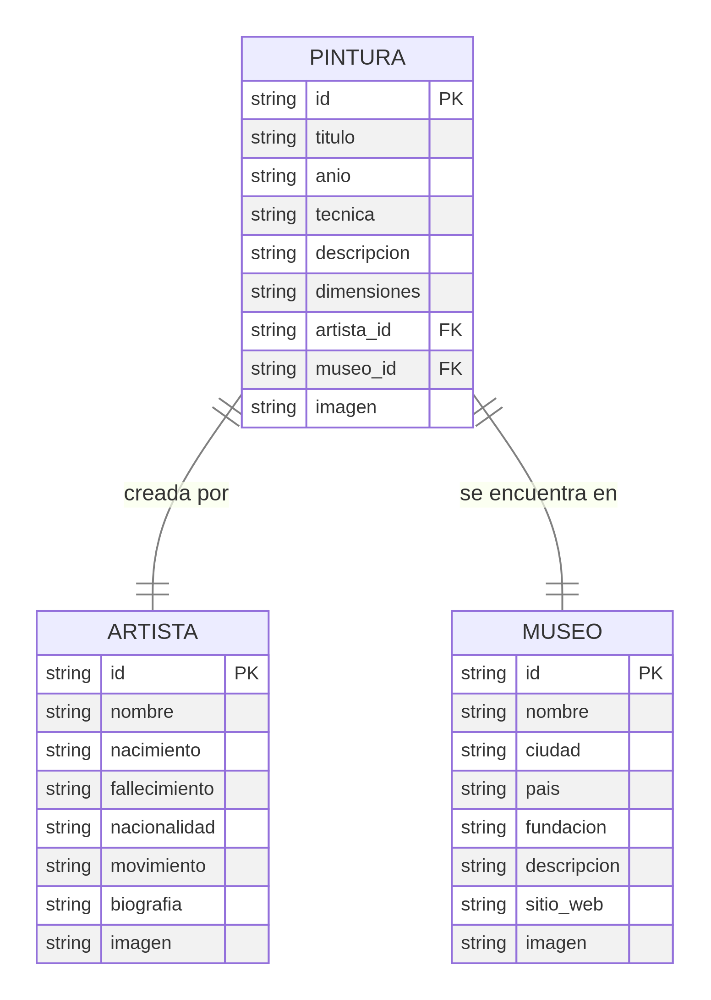

# Proyecto 1 - Manejo de Datos en React

## Catálogo de Pinturas Famosas

**Estudiantes:** [Nombres de los estudiantes]  
**Fecha:** Noviembre 2025  
**Asignatura:** Desarrollo Web  

---

## 1. Introducción

El presente documento describe el desarrollo de un catálogo interactivo de pinturas famosas, implementado como una aplicación web estática utilizando React y Wouter para el enrutamiento. El proyecto tiene como objetivo demostrar el manejo de datos estructurados mediante archivos JSON individuales, la navegación entre entidades relacionadas y la presentación de información de manera organizada y visualmente atractiva.

El catálogo está compuesto por tres entidades principales que se relacionan entre sí mediante identificadores únicos. La entidad principal corresponde a las **Pinturas**, mientras que las entidades secundarias son **Artistas** y **Museos**. Cada pintura está asociada con un artista que la creó y un museo donde actualmente se encuentra exhibida, permitiendo así una navegación fluida entre estas entidades.

---

## 2. Modelo de Datos

### 2.1. Diseño del Modelo Entidad-Relación

El modelo de datos del catálogo se estructura en tres entidades con relaciones claramente definidas. La siguiente figura muestra el diagrama Entidad-Relación del sistema:



El modelo establece las siguientes relaciones:

- Una **Pintura** es creada por un **Artista** (relación 1:1 desde la perspectiva de cada pintura)
- Una **Pintura** se encuentra en un **Museo** (relación 1:1 desde la perspectiva de cada pintura)
- Un **Artista** puede tener múltiples pinturas en el catálogo (relación 1:N)
- Un **Museo** puede albergar múltiples pinturas en el catálogo (relación 1:N)

### 2.2. Descripción de las Entidades

#### Entidad Principal: PINTURA

La entidad Pintura representa las obras de arte incluidas en el catálogo. Cada pintura contiene información detallada sobre la obra, incluyendo datos técnicos y descriptivos que permiten al usuario conocer sus características principales.

| Campo | Tipo | Descripción |
|-------|------|-------------|
| `id` | string | Identificador único de la pintura (clave primaria) |
| `titulo` | string | Nombre completo de la obra |
| `año` | string | Año o período de creación |
| `tecnica` | string | Técnica artística utilizada (óleo, fresco, temple, etc.) |
| `descripcion` | string | Descripción detallada de la obra y su contexto |
| `dimensiones` | string | Medidas de la obra (alto × ancho) |
| `artista_id` | string | Referencia al artista creador (clave foránea) |
| `museo_id` | string | Referencia al museo donde se encuentra (clave foránea) |
| `imagen` | string | Nombre del archivo de imagen |

**Total de registros:** 12 pinturas

#### Entidad Secundaria: ARTISTA

La entidad Artista almacena información biográfica sobre los creadores de las obras incluidas en el catálogo. Esta información contextualiza las pinturas dentro de la trayectoria y el estilo de cada artista.

| Campo | Tipo | Descripción |
|-------|------|-------------|
| `id` | string | Identificador único del artista (clave primaria) |
| `nombre` | string | Nombre completo del artista |
| `nacimiento` | string | Año de nacimiento |
| `fallecimiento` | string | Año de fallecimiento |
| `nacionalidad` | string | País de origen |
| `movimiento` | string | Movimiento o corriente artística |
| `biografia` | string | Reseña biográfica del artista |
| `imagen` | string | Nombre del archivo de imagen |

**Total de registros:** 6 artistas

#### Entidad Secundaria: MUSEO

La entidad Museo contiene información sobre las instituciones que albergan las obras del catálogo. Proporciona contexto sobre la ubicación actual de las pinturas y permite al usuario conocer más sobre estos espacios culturales.

| Campo | Tipo | Descripción |
|-------|------|-------------|
| `id` | string | Identificador único del museo (clave primaria) |
| `nombre` | string | Nombre oficial del museo |
| `ciudad` | string | Ciudad donde se ubica |
| `pais` | string | País donde se ubica |
| `fundacion` | string | Año de fundación |
| `descripcion` | string | Descripción del museo y su colección |
| `sitio_web` | string | URL del sitio web oficial |
| `imagen` | string | Nombre del archivo de imagen |

**Total de registros:** 6 museos

---

## 3. Estructura del Proyecto

### 3.1. Organización de Archivos

El proyecto sigue una estructura organizada que separa claramente los datos, las imágenes y el código de la aplicación:

```
catalogo-pinturas/
├── client/
│   ├── public/
│   │   ├── data/
│   │   │   ├── pinturas/          (12 archivos JSON)
│   │   │   ├── artistas/          (6 archivos JSON)
│   │   │   ├── museos/            (6 archivos JSON)
│   │   │   └── indices.json       (índice de todos los registros)
│   │   └── images/
│   │       ├── pinturas/          (12 imágenes)
│   │       ├── artistas/          (6 imágenes)
│   │       └── museos/            (6 imágenes)
│   └── src/
│       ├── components/
│       │   └── Header.tsx         (navegación principal)
│       ├── pages/
│       │   ├── Pinturas.tsx       (lista de pinturas)
│       │   ├── PinturaDetalle.tsx (detalle de pintura)
│       │   ├── Artistas.tsx       (lista de artistas)
│       │   ├── ArtistaDetalle.tsx (detalle de artista)
│       │   ├── Museos.tsx         (lista de museos)
│       │   └── MuseoDetalle.tsx   (detalle de museo)
│       └── App.tsx                (configuración de rutas)
└── generar_datos.py               (script de generación de datos)
```

### 3.2. Formato de Almacenamiento

Los datos se almacenan en archivos JSON individuales para cada registro, siguiendo el patrón especificado en los requisitos del proyecto. Cada archivo contiene un objeto JSON con todos los campos de la entidad correspondiente.

**Ejemplo de archivo de pintura** (`mona-lisa.json`):

```json
{
  "id": "mona-lisa",
  "titulo": "Mona Lisa (La Gioconda)",
  "año": "1503-1519",
  "tecnica": "Óleo sobre tabla de álamo",
  "descripcion": "Retrato de Lisa Gherardini...",
  "dimensiones": "77 cm × 53 cm",
  "artista_id": "leonardo-da-vinci",
  "museo_id": "museo-del-louvre",
  "imagen": "mona-lisa.jpg"
}
```

Adicionalmente, se creó un archivo `indices.json` que contiene listas de todos los identificadores de cada entidad, facilitando la carga inicial de datos en las páginas de listado.

---

## 4. Implementación Técnica

### 4.1. Tecnologías Utilizadas

El proyecto se desarrolló utilizando las siguientes tecnologías y herramientas:

- **React 19:** Biblioteca de JavaScript para construir interfaces de usuario
- **Wouter:** Librería ligera de enrutamiento para aplicaciones React
- **Tailwind CSS 4:** Framework de CSS para diseño responsivo
- **shadcn/ui:** Colección de componentes de interfaz reutilizables
- **Vite:** Herramienta de construcción y desarrollo rápido
- **TypeScript:** Superset de JavaScript con tipado estático

### 4.2. Navegación entre Entidades

La aplicación implementa un sistema de navegación bidireccional que permite al usuario explorar las relaciones entre las entidades:

**Desde Pinturas hacia entidades secundarias:**
- Cada página de detalle de pintura muestra enlaces hacia el artista que la creó y el museo donde se encuentra
- Los enlaces utilizan los campos `artista_id` y `museo_id` para navegar a las páginas correspondientes

**Desde entidades secundarias hacia Pinturas:**
- Las páginas de detalle de artistas muestran todas las pinturas de ese artista presentes en el catálogo
- Las páginas de detalle de museos muestran todas las pinturas que se encuentran en ese museo
- Estas listas se generan dinámicamente filtrando todas las pinturas según el ID del artista o museo

### 4.3. Diseño Visual

El diseño del sitio se inspiró en galerías de arte, utilizando una paleta de colores cálidos y tipografías elegantes:

- **Tipografía principal:** Lato (sans-serif) para el cuerpo del texto
- **Tipografía de títulos:** Playfair Display (serif) para encabezados
- **Paleta de colores:** Tonos cálidos con acento en naranja/terracota
- **Diseño responsivo:** Adaptable a dispositivos móviles, tabletas y escritorio

---

## 5. Catálogo de Datos

### 5.1. Pinturas Incluidas

El catálogo incluye 12 obras maestras de la historia del arte:

1. **Mona Lisa (La Gioconda)** - Leonardo da Vinci (1503-1519)
2. **La Última Cena** - Leonardo da Vinci (1495-1498)
3. **La Noche Estrellada** - Vincent van Gogh (1889)
4. **Los Girasoles** - Vincent van Gogh (1888)
5. **Guernica** - Pablo Picasso (1937)
6. **Las Señoritas de Avignon** - Pablo Picasso (1907)
7. **El Beso** - Gustav Klimt (1907-1908)
8. **La Joven de la Perla** - Johannes Vermeer (1665)
9. **El Grito** - Edvard Munch (1893)
10. **Las Meninas** - Diego Velázquez (1656)
11. **El Nacimiento de Venus** - Sandro Botticelli (1485)
12. **La Creación de Adán** - Miguel Ángel (1511)

### 5.2. Artistas Representados

El catálogo incluye información sobre 6 artistas destacados:

1. **Leonardo da Vinci** (1452-1519) - Renacimiento italiano
2. **Vincent van Gogh** (1853-1890) - Post-impresionismo holandés
3. **Pablo Picasso** (1881-1973) - Cubismo español
4. **Gustav Klimt** (1862-1918) - Art Nouveau austriaco
5. **Diego Velázquez** (1599-1660) - Barroco español
6. **Edvard Munch** (1863-1944) - Expresionismo noruego

### 5.3. Museos Incluidos

El catálogo presenta información sobre 6 museos de renombre mundial:

1. **Museo del Louvre** - París, Francia (fundado en 1793)
2. **Museum of Modern Art (MoMA)** - Nueva York, Estados Unidos (fundado en 1929)
3. **Museo Nacional Centro de Arte Reina Sofía** - Madrid, España (fundado en 1992)
4. **Museo Nacional del Prado** - Madrid, España (fundado en 1819)
5. **Galería de los Uffizi** - Florencia, Italia (fundado en 1581)
6. **Österreichische Galerie Belvedere** - Viena, Austria (fundado en 1903)

---

## 6. Funcionalidades Implementadas

El sitio web implementa las siguientes funcionalidades principales:

### 6.1. Páginas de Listado

Cada tipo de entidad cuenta con una página de listado que muestra todos los registros disponibles en formato de tarjetas (cards). Las tarjetas incluyen una imagen representativa, el título o nombre principal, y datos complementarios relevantes. Al hacer clic en cualquier tarjeta, el usuario navega a la página de detalle correspondiente.

### 6.2. Páginas de Detalle

Las páginas de detalle muestran información completa sobre cada registro, incluyendo:

- Imagen principal en alta resolución
- Todos los campos de datos de la entidad
- Enlaces de navegación hacia entidades relacionadas
- Botón de regreso a la página de listado

### 6.3. Navegación Global

El sitio cuenta con un encabezado (header) fijo que permanece visible en todas las páginas, permitiendo al usuario navegar rápidamente entre las tres secciones principales del catálogo: Pinturas, Artistas y Museos.

### 6.4. Diseño Responsivo

Todas las páginas se adaptan automáticamente a diferentes tamaños de pantalla, proporcionando una experiencia óptima tanto en dispositivos móviles como en computadoras de escritorio.

---

## 7. Proceso de Desarrollo

### 7.1. Recolección de Información

La información sobre las pinturas, artistas y museos se recopiló de fuentes confiables en línea, incluyendo sitios web de museos, enciclopedias de arte y artículos especializados. Se priorizó la selección de obras icónicas que representaran diferentes períodos y movimientos artísticos.

### 7.2. Generación de Datos

Para facilitar la creación de los archivos JSON individuales, se desarrolló un script en Python (`generar_datos.py`) que genera automáticamente todos los archivos de datos a partir de estructuras de datos definidas en el código. Este enfoque garantiza consistencia en el formato y reduce errores de escritura manual.

### 7.3. Búsqueda de Imágenes

Las imágenes de las pinturas, artistas y museos se obtuvieron mediante búsquedas especializadas, seleccionando fotografías de alta calidad que representaran fielmente cada elemento del catálogo. Todas las imágenes se optimizaron y organizaron en carpetas específicas dentro del directorio `public/images`.

### 7.4. Desarrollo de la Interfaz

El desarrollo de la interfaz siguió un enfoque modular, creando componentes reutilizables y páginas específicas para cada tipo de entidad. Se utilizó el sistema de diseño de shadcn/ui para mantener consistencia visual y se aplicaron principios de diseño centrado en el usuario.

---

## 8. Despliegue

### 8.1. URL del Sitio Publicado

El sitio web está disponible en la siguiente dirección:

**URL:** [Se completará después del despliegue en Netlify]

### 8.2. Instrucciones de Despliegue

Para desplegar el proyecto en Netlify, se deben seguir los siguientes pasos:

1. Crear una cuenta en Netlify (https://www.netlify.com)
2. Conectar el repositorio del proyecto
3. Configurar los comandos de construcción:
   - Build command: `pnpm build`
   - Publish directory: `client/dist`
4. Iniciar el despliegue

El sitio se actualizará automáticamente con cada cambio en el repositorio.

---

## 9. Conclusiones

El proyecto ha cumplido exitosamente con todos los requisitos establecidos, implementando un catálogo interactivo de pinturas famosas con navegación fluida entre entidades relacionadas. La estructura de datos basada en archivos JSON individuales permite una fácil gestión y actualización del contenido, mientras que la interfaz desarrollada en React proporciona una experiencia de usuario moderna y responsiva.

El modelo de datos diseñado demuestra una comprensión clara de las relaciones entre entidades y permite explorar el catálogo desde múltiples perspectivas: por obra, por artista o por museo. La implementación técnica refleja buenas prácticas de desarrollo web, incluyendo componentes reutilizables, tipado estático con TypeScript y diseño responsivo.

Este proyecto sienta las bases para futuras expansiones, como la incorporación de funcionalidades de búsqueda, filtrado por período o movimiento artístico, o la integración con APIs externas para obtener información adicional sobre las obras de arte.

---

## 10. Referencias

Las imágenes y la información presentada en este catálogo se obtuvieron de fuentes públicas y sitios web oficiales de museos. El proyecto tiene fines exclusivamente educativos.

---

**Fin del documento**
